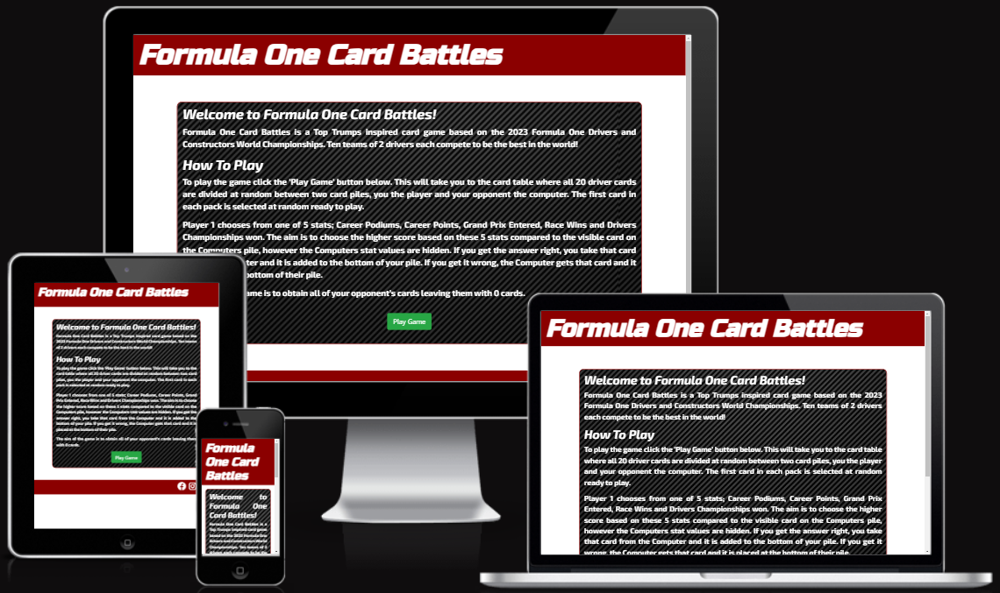
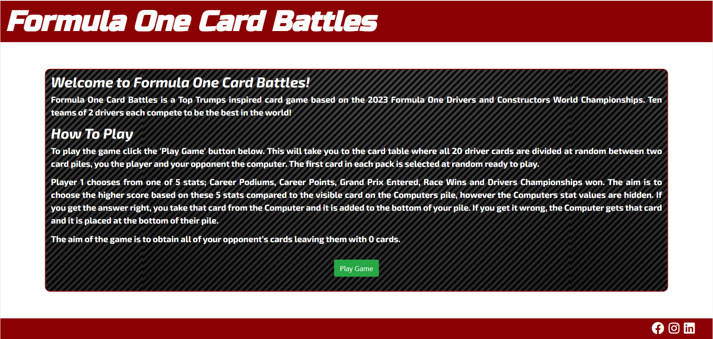
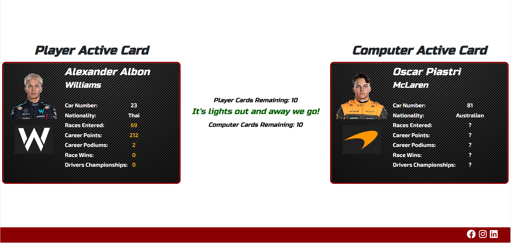
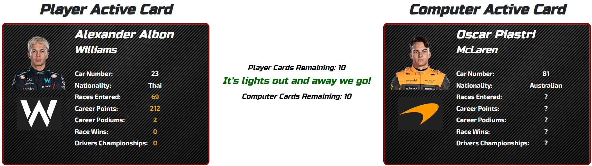
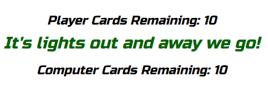
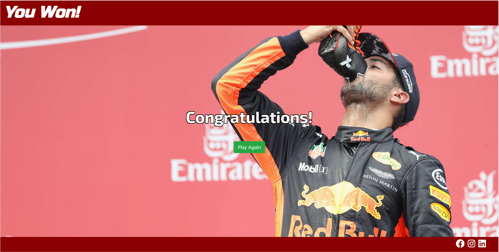
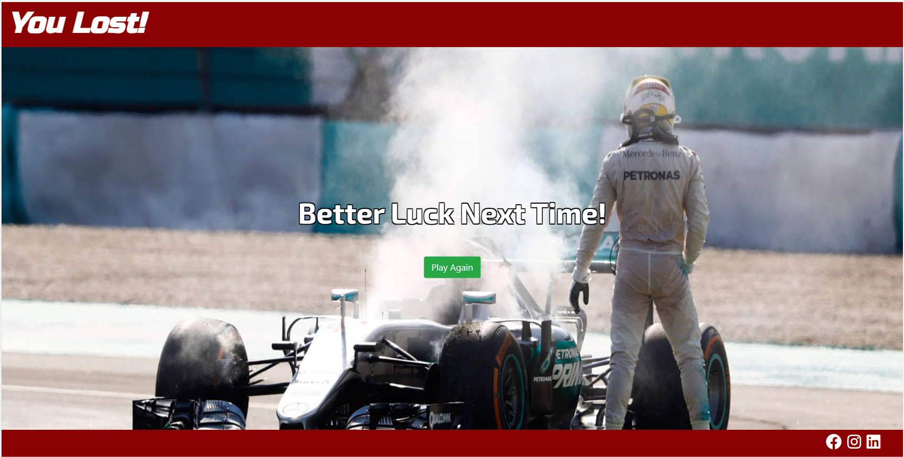
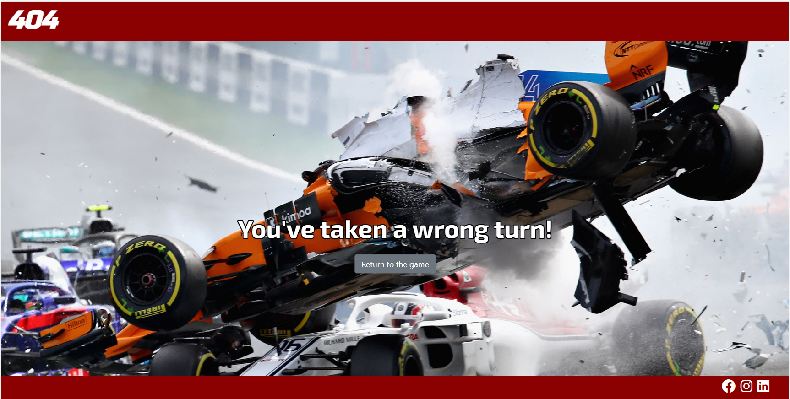

# Formula 1 Card Battles
## Interactive Front End Development Project

For my second project I am creating a Top Trumps style game using the 2023 Formula 1 championships drivers and teams. The game involves a deck of 20 cards representing each current driver from the 10 teams that represent the Formula 1 world championship. The aim is to reduce your opponent’s cards pile to zero. If this is achieved the player will be notified that they have won, however, if the computer obtains all their cards they will be notified of their loss.



---
## User Experience (UX) & Design
---
### User Stories
- First Time Visitor

    - As a first time visitor,  I want to get to understand the main purpose of the site.
    - As a first time visitor,  I want to receive feedback on how I'm progressing in the game.
    - As a first time visitor,  I want to know if I've won or lost the game.

- Returning Visitor

    - As a returning visitor, I want to be able to quickly jump back into another game if I've won or lost.

- Website Administrator

    - As a website administrator, I want to provide links to my social media channels.

### Color Scheme
The colors selected for the color palette are colors that are usually associated with Formula One:
- Red for the lights out signal to start the race.
- White and black for the chequered flag and green
- Yellow to indicate to drivers if there is caution ahead
- Green to dictate that normal racing can resume.


### Typography
Google Fonts was used to import the 'Russo One' and the 'Exo 2' fonts into the style.css file for use across all pages.

### Wireframes
Each link contains wireframes for mobile, tablet and desktop.
- [Home/Index](documentation/wireframes/Index.png)
- [Game Page](documentation/wireframes/Game.png)
- [Player Win Page](documentation/wireframes/Player%20Win.png)
- [Computer Win Page](documentation/wireframes/Computer%20Win.png)
- [404 Page Page](documentation/wireframes/404.png)
---
## Features
---
### Index/Home Page
The Index/Home Page is the introduction to the game that provides an explanation on how to play, how the cards are dealt and what you need to win the game.


### Footer
The footer is present on each page and provides links to my social media profiles.


### Game Page
The game page is where all the elements come together for the game to be played out.


### Card Table
The card table comprises of the active card for the player and the computer and also contains the scorecard and game progress message board.


### Scorecard and game progress message board.
The score card displays the number of card held by the player and the computer. The message board displays an initital message to confirm the game has started and will then display who won the previous round or if it was a tie.


### Player / Computer Win Pages
Two individual pages to tell the player if they have won or if the computer has one. There is a button on each page to take you back into the game to play another round!



### 404 Page
A custom 404 page has been created and assigned via GitHub to load whenever a non-existent page is requested.


---
## Technologies Used
---
### Languages Used
- [HTML5](https://en.wikipedia.org/wiki/HTML5)
- [CSS](https://en.wikipedia.org/wiki/Cascading_Style_Sheets)
- [JavaScript](https://en.wikipedia.org/wiki/JavaScript)

### Frameworks, Libraries and Programs Used
- [Balsamiq](https://balsamiq.com/) was used for pre-visualisation of the pages.
- [Google Fonts](https://fonts.google.com/) was used to import the the 'Russo One' and 'Exo 2' fonts into the style.css file.
- [Font Awesome](https://fontawesome.com/) was utilised for icons used on the site for the social media icons.
- [Bootstrap](https://getbootstrap.com/docs/4.3/getting-started/introduction/) was used for responsive grids, table and button elements.
- [Git](https://git-scm.com/) was used for version control. I utilised the CLI terminal in GitPod & codeanywhere to commit and push to GitHub.
- [Visual Studio Code](https://code.visualstudio.com/) was used as the development enviroment to develop the site.
- [GitHub](https://github.com/) was used as the repository for the project after being pushed from GitPod.
- [TinyPNG](https://tinypng.com/) used for image compression.
- [Adobe Color](https://color.adobe.com/create/color-wheel) used to produce the color palette image in the README.

---
## Testing
---
### Validator Testing
#### HTML
HTML Markup Validator results:
- [index.html](https://validator.w3.org/nu/?doc=https%3A%2F%2Fahendley84.github.io%2FFormula-1-Card-Battles%2Findex.html)
- [game.html](https://validator.w3.org/nu/?doc=https%3A%2F%2Fahendley84.github.io%2FFormula-1-Card-Battles%2Fgame.html)
- [player_win.html](https://validator.w3.org/nu/?doc=https%3A%2F%2Fahendley84.github.io%2FFormula-1-Card-Battles%2Fplayer_win.html)
- [computer_win.html](https://validator.w3.org/nu/?doc=https%3A%2F%2Fahendley84.github.io%2FFormula-1-Card-Battles%2Fcomputer_win.html)
- [404.html](https://validator.w3.org/nu/?doc=https%3A%2F%2Fahendley84.github.io%2FFormula-1-Card-Battles%2F404.html)


#### CSS
- [CSS Validation](https://jigsaw.w3.org/css-validator/validator?uri=https%3A%2F%2Fahendley84.github.io%2FFormula-1-Card-Battles%2Fassets%2Fcss%2Fstyle.css&profile=css3svg&usermedium=all&warning=1&vextwarning=&lang=en)


#### JavaScript
- The JavaScript used in this project has been tested on both [JSLint](https://www.jslint.com/) and [JSHint](https://jshint.com/) with no concerns.


### Browser Compatibility
The site has been tested on the following browsers (latest builds as of 18/08/2023):
- Google Chrome version Version 116.0.5845.96 (Official Build) (64-bit)
- Mozilla Firefox Version 116.0.3 (64-bit)
- Microsoft Edge Version 115.0.1901.203 (Official build) (64-bit)
- Apple Safari (Latest build on iOS 16.6)

### Manual Testing and Results
Here is a table of the manual testing done on the site to determine if all features work as described and designed:

|Feature Tested|Required Action|Expected Outcome|Result|
|---|---|---|---|


### User Story Testing

### Lighthouse Test

### Resposiveness

### Bugs
- Bug 1 - Nationality on the active computer card was displaying a number
Issue: 
```
compNat.innerText = `${computerCardCurrent[0].driverChampionships}`;
```
The above line of code was pointing to the number of drivers championships rather than the nationality.
Fix:
```
compNat.innerText = `${computerCardCurrent[0].nationality}`;
```
Amending the code to look at the nationality inside the active card object resolved the issue.

- Bug 2 - Uncaught TypeError: Cannot read properties of undefined (reading 'img1')
Issue: Uncaught TypeError: Cannot read properties of undefined (reading 'img1')
```
function assignCurrentCard() {
    const playerCurrent = Math.floor((Math.random() * playerCards.length));
    const computerCurrent = Math.floor((Math.random() * computerCards.length));

    playerCardCurrent.push(playerCards.splice(playerCurrent, 1)[0]);
    computerCardCurrent.push(computerCards.splice(computerCurrent, 1)[0]);
};
```
The above error kept occuring in the console. What was visibile in the game was the drivers name, team name and the drivers would change, however, the drivers image and team image would remain the same as the previous card. I tried multiple times to understand what was casuing the issue but couldn't see from the code what was causing it. I searched via Google for some answers and found generic responses to the error code, but none that would fix the issue. I decided to reach out to the #project-milestone-2 channel for some guidance. The guidance helped me fix and improve my code.
Fix:
```
function assignCurrentCard() {
    if (playerCards.length > 0) {
        const playerCurrent = Math.floor((Math.random() * playerCards.length));
        playerCardCurrent.push(playerCards.splice(playerCurrent, 1)[0]);
    };

    if (computerCards.length > 0) {
        const computerCurrent = Math.floor((Math.random() * computerCards.length));
        computerCardCurrent.push(computerCards.splice(computerCurrent, 1)[0]);
    };
    displayImages();
    displayDriverStats();
};
```
### Unfixed Bugs

---
## Deployment
---
### How the site was deployed

---
## Credits & Acknowledgments
---
- Massive thank you to [astral-g](https://github.com/astral-g) for his [Top Trumps Game](https://github.com/astral-g/Top-Trumps-Game) which allowed me to base and modify my own game on.
- Driver and Team Logo images courtsey of skysports.com.
- Driver stats and information courtsey of Formula1.com.
- Image used in 404.html courtesy of [CNN.com](https://edition.cnn.com/2018/08/30/motorsport/formula-one-crashes-defined-sport-halo-spt-intl/index.html).
- Thanks to [Stack Overflow](https://stackoverflow.com/questions/4919076/outline-effect-to-text) for help on applying the text-shadow to the text on the 404, Player Win and Computer Win pages.
- Credit to [W3 Schools](https://www.w3schools.com/jsref/prop_style_cursor.asp) for the cursor change property guidance.
- Thanks to [GitHub](https://docs.github.com/en/pages/getting-started-with-github-pages/creating-a-custom-404-page-for-your-github-pages-site) for this handy guide to adding your own custom 404 page.